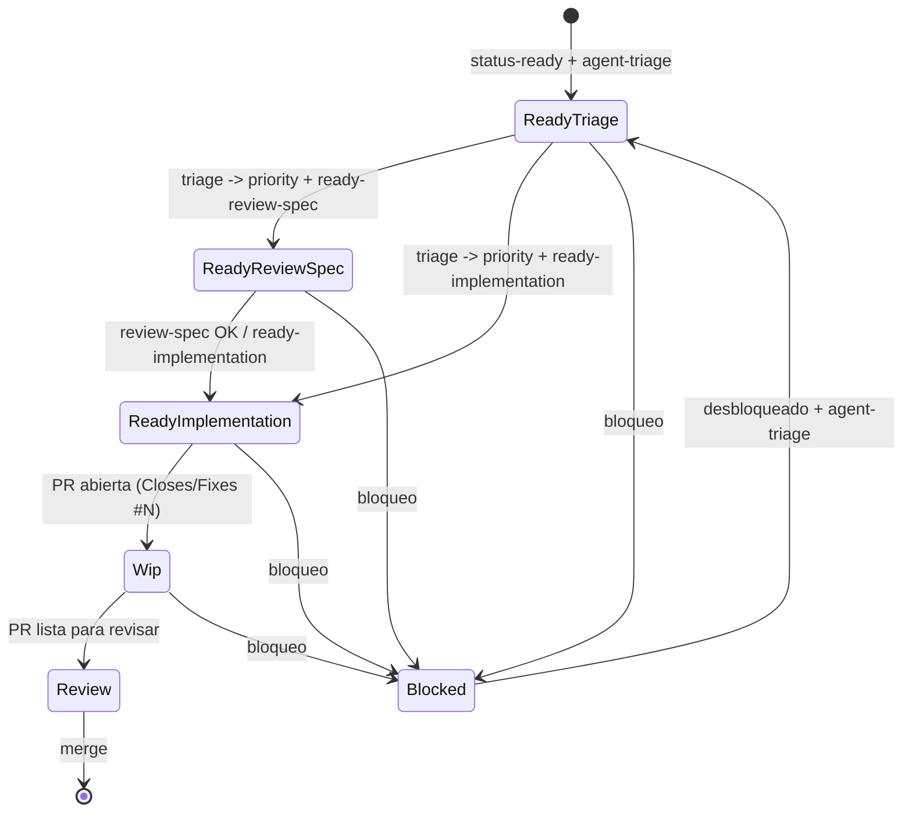

# Parent Agent

## Rol
Orquestar subagentes y mantener flujo estable sin choques.

## Modo de ejecucion
- El agente padre no ejecuta trabajo directo de producto; solo orquesta subagentes.
- Si una tarea no tiene subagente definido, detener ejecucion y pedir definicion al usuario.
- Cuando haya tareas independientes, despachar subagentes en paralelo.
- Nunca correr subagentes paralelos en el mismo directorio de trabajo.

## State Machine

Notas:
- Un solo `status:*` por issue.
- Un solo `agent:*` por issue.
- Un solo `priority:*` por issue.
- Un solo `ready:*` por issue.
- Default assignment: si `status:ready` sin agente, asignar `agent:triage`.

## Fuente de verdad
- Subagentes en `.agents/sub-agents/*.md`.
- Cada subagente define: `Rol`, `Trigger`, `Reglas`, `Salida`, `Ejecucion minima`.

## Protocolo de orquestacion
1. Detectar estado del issue (`status:*`).
2. Asignar `agent:*` si falta (default `agent:triage` para `status:ready`).
3. Elegir subagente por `agent:*` y trigger.
4. Para paralelizar, crear un `worktree` exclusivo por issue.
5. Ejecutar subagentes en paralelo solo para issues independientes.
6. Validar salida esperada.
7. Actualizar estado y reportar resultado corto.

## Regla anti-colision
- Un issue solo puede tener un `status:*` activo.
- Un issue solo puede tener un `agent:*` activo.
- Si hay PR abierta que lo referencia: priorizar `status:wip`.
- Todo subagente debe trabajar en `worktree` dedicado (`.worktrees/issue-<id>-<slug>`).
- Si un `worktree` esta en uso o sucio, no reutilizarlo; crear uno nuevo.

## Alta de nuevos subagentes
1. Crear archivo en `.agents/sub-agents/<name>.md`.
2. Mantener formato minimo estandar.
3. Definir trigger no ambiguo.
4. Probar en un issue real y ajustar reglas.

## Respuesta estandar del padre
- `#issue -> subagente -> accion -> resultado`.
