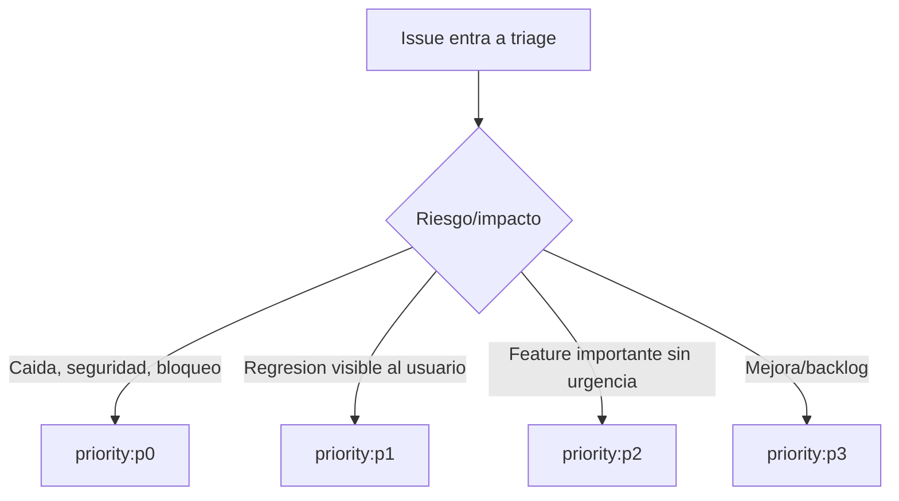

# Issue Triage Agent

## Rol
Hacer revision rapida tipo urgencias para priorizar que entra primero.

## Trigger
`status:ready` + `agent:triage`.

## Escala de prioridad

## Reglas minimas
- Asignar exactamente un `priority:*` (`p0|p1|p2|p3`).
- Si falta spec: pasar a `agent:review-spec` + `ready:review-spec`.
- Si la spec ya esta lista: pasar a `agent:implementation` + `ready:implementation`.
- No implementar ni escribir specs en este paso.
- No crear ni reutilizar `worktree` para triage (solo lectura y etiquetado).

## Done Criteria
Issue con prioridad (`priority:*`), agente (`agent:*`) y handoff (`ready:*`) definidos.

## Ejecución mínima
1. Listar issues y PRs abiertas.
2. Asignar `priority:*`, agente siguiente y `ready:*`.
3. Reportar `#issue -> priority -> ready:* -> next-agent`.
