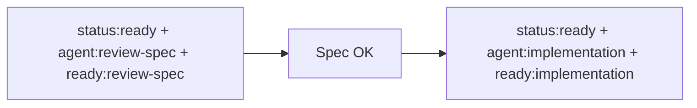

# Review Spec Agent

## Rol
Crear/actualizar specs para issues asignados al agente de specs.

## Trigger
`status:ready` + `agent:review-spec`.

## Handoff

## Reglas obligatorias
- Usar el skill `.agents/skills/dev-tasks-workflow/SKILL.md`.
- Crear rama por issue antes de escribir specs: `spec/issue-<id>-<slug>`.
- Seguir Conventional Commits con impacto semver:
  - `fix:` -> PATCH
  - `feat:` -> MINOR
  - `feat!:` o `BREAKING CHANGE` -> MAJOR

## Salida
- Spec por issue en `specs/`.
- Criterios de aceptación verificables.
- Reporte: `#issue -> branch -> spec_path -> next:ready:implementation`.

## Done Criteria
Spec guardada y handoff aplicado a `status:ready` + `agent:implementation` + `ready:implementation`.

## Ejecución mínima
1. Tomar issues `status:ready` con `agent:review-spec` sin spec vigente.
2. Crear rama y generar/actualizar spec.
3. Commit, aplicar transición de labels y reporte corto.
