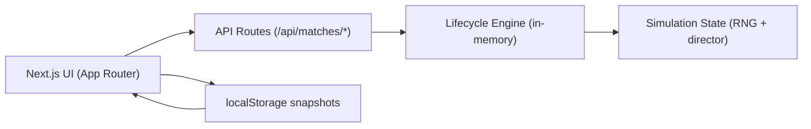

# Hunger Games Simulator

Simulador narrativo tipo battle royale construido con Next.js + TypeScript.  
Permite crear partidas, avanzar turnos con tension dinamica y reanudar sesiones usando snapshots locales.


## Que resuelve

- Simulacion automatica por turnos (`bloodbath -> day/night -> finale`) hasta un unico ganador.
- Roster configurable de `10` a `48` participantes.
- Tension progresiva y variedad de eventos (`combat`, `alliance`, `betrayal`, `resource`, `hazard`, `surprise`).
- Lobby con acceso rapido, historial y acciones de reanudar/duplicar setup/eliminar.
- Persistencia local con checksum para detectar snapshots corruptos.

## Stack tecnico

- Framework: Next.js App Router
- Lenguaje: TypeScript estricto
- Validacion de contratos: Zod
- Testing: Vitest + cobertura V8 (threshold `90%`)
- Estado de juego server-side: memoria en proceso (`Map` en `lib/matches/lifecycle.ts`)

## Inicio rapido

```bash
npm install
npm run dev
```

Aplicacion local: [http://localhost:3000](http://localhost:3000)

## Scripts

| Comando | Descripcion |
| --- | --- |
| `npm run dev` | Levanta entorno local |
| `npm run build` | Build de produccion |
| `npm run start` | Ejecuta build generado |
| `npm run lint` | Lint de Next.js |
| `npm run test:unit` | Tests unitarios |
| `npm run test:coverage` | Tests con cobertura |
| `npm run validate` | Gate completo (`lint + unit + coverage`) |

## Flujo funcional

1. Crear setup de partida (`/matches/new`) con roster, seed opcional y perfil.
2. Iniciar partida (crea match + `start`).
3. Avanzar simulacion en vivo (auto o paso a paso).
4. Visualizar feed narrativo, estado de participantes y tension.
5. Guardar/reabrir partidas en localStorage y recuperar contexto tras refresh.

## API principal

| Metodo | Ruta | Uso |
| --- | --- | --- |
| `POST` | `/api/matches` | Crear partida en fase `setup` |
| `POST` | `/api/matches/:matchId/start` | Pasar a fase `running` |
| `POST` | `/api/matches/:matchId/turns/advance` | Avanzar un turno |
| `GET` | `/api/matches/:matchId` | Leer estado actual |
| `POST` | `/api/matches/resume` | Rehidratar estado desde snapshot |

### Ejemplo rapido: crear partida

```bash
curl -X POST http://localhost:3000/api/matches \
  -H "content-type: application/json" \
  -d '{
    "roster_character_ids": ["char-01","char-02","char-03","char-04","char-05","char-06","char-07","char-08","char-09","char-10"],
    "settings": {
      "surprise_level": "normal",
      "event_profile": "balanced",
      "simulation_speed": "1x",
      "seed": null
    }
  }'
```

### Rate limiting (por IP / `x-forwarded-for`)

- `create`: 20 req/min
- `advance`: 120 req/min
- `resume`: 60 req/min

## Persistencia local

Claves usadas en `localStorage`:

- `hunger-games.local-matches.v1`: historial de partidas resumidas.
- `hunger-games.local-runtime.v1`: snapshot runtime de la simulacion activa.
- `hunger-games.local-prefs.v1`: preferencias (ej. `autosave_enabled`).

Si un snapshot/version/checksum no valida, la app marca la partida como no recuperable y permite iniciar una nueva.

## Estructura del proyecto

```text
app/
  api/matches/...         # Endpoints de juego
  matches/...             # UI de lobby, setup y detalle
lib/
  domain/                 # Tipos y schemas (contratos)
  matches/lifecycle.ts    # Motor lifecycle in-memory
  simulation-state.ts     # RNG, director de tension, seleccion de eventos
tests/                    # Suite Vitest
specs/                    # Especificaciones por capas + planes
```

## Notas de arquitectura



## Calidad y contribucion

- Mantener contratos sincronizados en:
  - `lib/domain/schemas.ts`
  - `lib/domain/types.ts`
  - `tests/domain-contracts.test.ts`
- Antes de abrir PR: `npm run validate`.
- Convencion de commits: Conventional Commits.
