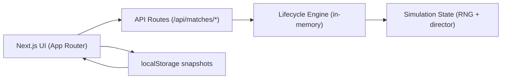

# Hunger Games Simulator

Narrative battle royale simulator built with Next.js + TypeScript.
It lets users create matches, advance turns with dynamic tension, and resume sessions with local snapshots.


## What It Solves

- Automatic turn-based simulation (`bloodbath -> day/night -> finale`) until one winner remains.
- Configurable roster from `10` to `48` participants.
- Progressive tension and event variety (`combat`, `alliance`, `betrayal`, `resource`, `hazard`, `surprise`).
- Root setup screen plus history actions to resume, duplicate setup, summarize, or delete local matches.
- Local persistence with checksum to detect corrupted snapshots.

## Technical Stack

- Framework: Next.js App Router
- Language: strict TypeScript
- Contract validation: Zod
- Testing: Vitest + V8 coverage (threshold `90%`) + Playwright E2E
- Server-side game state: in-process memory (`Map` in `lib/matches/lifecycle.ts`)

## Quick Start

```bash
pnpm install
pnpm run dev
```

Local app: [http://localhost:3000](http://localhost:3000)

## Scripts

| Command | Description |
| --- | --- |
| `pnpm run dev` | Start local dev environment |
| `pnpm run build` | Production build |
| `pnpm run start` | Run generated build |
| `pnpm run lint` | Next.js lint |
| `pnpm run test:e2e` | Playwright E2E tests |
| `pnpm run test:unit` | Unit tests |
| `pnpm run test:coverage` | Coverage tests |
| `pnpm run validate` | Full gate (`lint + unit + coverage + e2e`) |

## Observability

- Vercel Analytics enabled in `app/layout.tsx` with `@vercel/analytics`.
- Google Analytics 4 enabled in `app/layout.tsx` with `NEXT_PUBLIC_GA_MEASUREMENT_ID`.
- PostHog enabled in `app/layout.tsx` with `NEXT_PUBLIC_POSTHOG_KEY` and `NEXT_PUBLIC_POSTHOG_HOST`.
- Cloudflare Web Analytics enabled in `app/layout.tsx` using the official beacon.
- Required configuration:
  - `NEXT_PUBLIC_GA_MEASUREMENT_ID`
  - `NEXT_PUBLIC_POSTHOG_KEY`
  - `NEXT_PUBLIC_POSTHOG_HOST`
  - `NEXT_PUBLIC_CLOUDFLARE_ANALYTICS_TOKEN`

### Validate Vercel Analytics

1. Deploy the app to Vercel.
2. Navigate through the app to generate traffic.
3. Check `Vercel Dashboard -> Project -> Analytics`.

### Validate Cloudflare Web Analytics

1. Configure the Cloudflare Web Analytics token in `NEXT_PUBLIC_CLOUDFLARE_ANALYTICS_TOKEN`.
2. Deploy and navigate the app.
3. Check `Cloudflare Dashboard -> Web Analytics` and confirm page views/events.

### Validate Google Analytics 4

1. Configure the measurement ID in `NEXT_PUBLIC_GA_MEASUREMENT_ID`.
2. Deploy and navigate the app.
3. Check `Google Analytics -> Reports -> Realtime`.

### Validate PostHog

1. Configure `NEXT_PUBLIC_POSTHOG_KEY` and `NEXT_PUBLIC_POSTHOG_HOST`.
2. Deploy and navigate the app.
3. Check PostHog for host `hunger-games.sebecode.com`.

## Functional Flow

1. Create match setup (`/`) with roster, optional seed, and profile.
2. Start match (creates match + `start`).
3. Advance live simulation automatically.
4. View narrative feed, participant state, and tension.
5. Save/reopen matches in localStorage and recover context after refresh.
6. Use `/sessions` to resume, summarize, duplicate, or delete local matches.

## Main API

| Method | Route | Use |
| --- | --- | --- |
| `POST` | `/api/matches` | Create match in `setup` phase |
| `POST` | `/api/matches/:matchId/start` | Move to `running` phase |
| `POST` | `/api/matches/:matchId/turns/advance` | Advance one turn |
| `GET` | `/api/matches/:matchId` | Read current state |
| `POST` | `/api/matches/resume` | Rehydrate state from snapshot |

### Quick Example: Create Match

```bash
curl -X POST http://localhost:3000/api/matches \
  -H "content-type: application/json" \
  -d '{
    "roster_character_ids": ["char-01","char-02","char-03","char-04","char-05","char-06","char-07","char-08","char-09","char-10"],
    "settings": {
      "surprise_level": "normal",
      "event_profile": "balanced",
      "simulation_speed": "1x",
      "seed": null
    }
  }'
```

### Rate Limiting (by IP / `x-forwarded-for`)

- `create`: 20 req/min
- `advance`: 120 req/min
- `resume`: 60 req/min

## Local Persistence

Keys used in `localStorage`:

- `hunger-games.local-matches.v1`: history of resumable matches.
- `hunger-games.local-runtime.v1`: runtime snapshot for the active simulation.
- `hunger-games.local-prefs.v1`: preferences, for example `autosave_enabled`.

If snapshot/version/checksum validation fails, the app marks the match as unrecoverable and allows starting a new one.

## Project Structure

```text
app/
  api/matches/...         # Game endpoints
  _sessions/...           # History helpers
  new/...                 # Setup/runtime shared implementation
  sessions/...            # History and match detail routes
lib/
  domain/                 # Types and schemas (contracts)
  matches/lifecycle.ts    # Motor lifecycle in-memory
  simulation-state.ts     # RNG, tension director, event selection
tests/                    # Suite Vitest
specs/                    # Layered specs + plans
```

## Architecture Notes


```mermaid
flowchart LR
  UI["Next.js UI (App Router)"] --> API["API Routes (/api/matches/*)"]
  API --> Lifecycle["Lifecycle Engine (in-memory)"]
  Lifecycle --> Sim["Simulation State (RNG + director)"]
  UI --> Local["localStorage snapshots"]
  Local --> UI
```

## Quality and Contribution

- Keep contracts synchronized in:
  - `lib/domain/schemas.ts`
  - `lib/domain/types.ts`
  - `tests/domain-contracts.test.ts`
- Before opening a PR: `pnpm run validate`.
- Commit convention: Conventional Commits.
