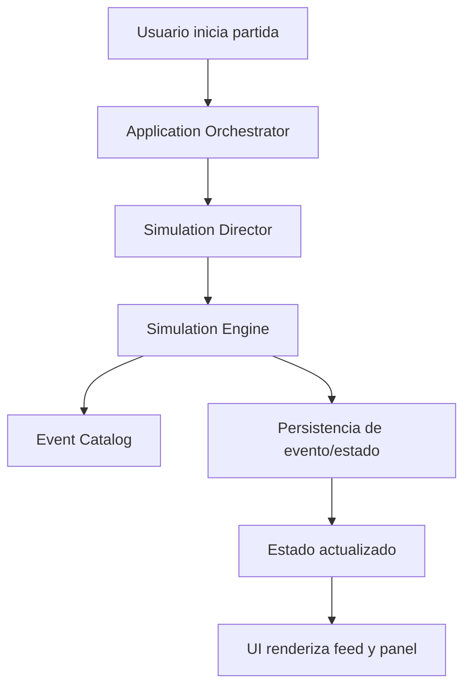

# Layer 7 - Architecture

## Estilo
Arquitectura modular con separación de responsabilidades entre UI, orquestación de partida y motor de simulación.

## Módulos
- `Presentation`: setup, simulación en vivo, final.
- `Application`: casos de uso (`createMatch`, `startMatch`, `advanceTurn`, `getMatchState`).
- `Domain Simulation Engine`: reglas de interacción, tensión, relaciones y resolución de eventos.
- `Simulation Director`: pacing por fases (`bloodbath/day/night/finale`) y tensión global.
- `Event Catalog`: plantillas narrativas + pesos + reglas anti-repetición.
- `Persistence`: repositorios de partidas, participantes, eventos, relaciones.
- `Replay/Share`: lectura por código y replay por seed.

## Flujo abstracto

## Reglas arquitectónicas
- Motor de simulación desacoplado de UI y de framework web.
- Contratos explícitos entre casos de uso y persistencia.
- Eventos como fuente narrativa principal de la partida.
- Semilla y versión de reglas trazables por partida para reproducibilidad.
- Configuración de partida separada del estado dinámico de la partida.
