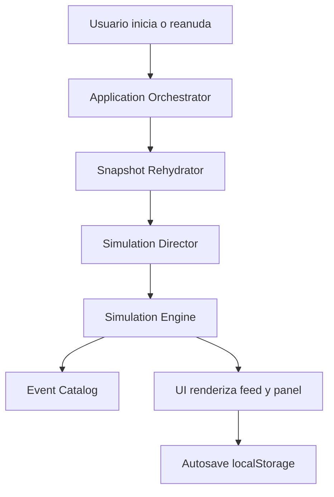

# Layer 7 - Architecture

## Estilo
Arquitectura modular con separación de responsabilidades entre UI, orquestación de partida y motor de simulación.

## Módulos
- `Presentation`: setup, simulación en vivo, final, menú de partidas locales.
- `Application`: casos de uso (`createMatch`, `startMatch`, `resumeMatch`, `advanceTurn`, `getMatchState`).
- `Domain Simulation Engine`: reglas de interacción, tensión, relaciones y resolución de eventos.
- `Simulation Director`: pacing por fases (`bloodbath/day/night/finale`) y tensión global.
- `Event Catalog`: plantillas narrativas + pesos + reglas anti-repetición.
- `Snapshot Rehydrator`: validación y carga de snapshot cliente versionado.
- `Local Recovery`: serialización/lectura de snapshot en `localStorage` (cliente).

## Flujo abstracto

## Reglas arquitectónicas
- Motor de simulación desacoplado de UI y de framework web.
- Contratos explícitos entre casos de uso y snapshot de partida.
- Servidor stateless para continuidad: sin recuperación desde memoria o filesystem.
- Recuperación orientada a snapshot en `localStorage` enviado por cliente.
- Estado local versionado para manejo de incompatibilidades entre releases.
