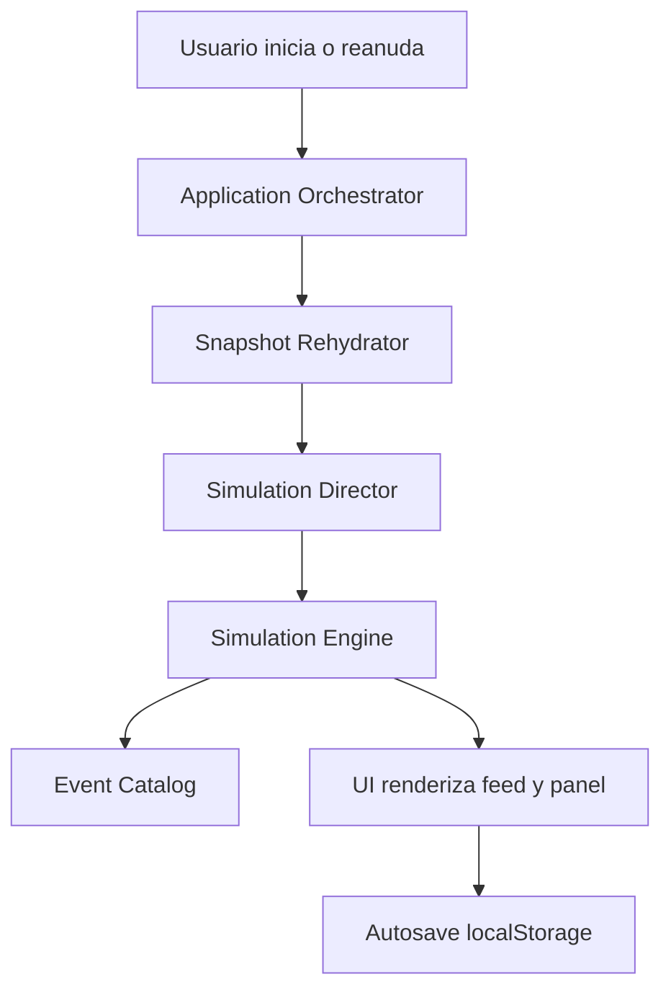

# Architecture

## Estilo

Arquitectura modular con separacion entre UI, orquestacion de partida y motor de simulacion.

## Stack

- Framework: Next.js App Router.
- Lenguaje: TypeScript estricto.
- UI: shadcn/ui + Tailwind CSS.
- Estado cliente: React state + `localStorage`.
- Backend: Route Handlers de Next.js.
- Server runtime: stateless por request.
- Validacion: Zod en fronteras API y estado local.
- Testing: Vitest y Playwright.
- Telemetria: eventos estructurados compatibles con OpenTelemetry.

## Modulos

- `Presentation`: setup, simulacion en vivo, final y menu de partidas locales.
- `Application`: `createMatch`, `startMatch`, `resumeMatch`, `advanceTurn`, `getMatchState`.
- `Domain Simulation Engine`: reglas de interaccion, tension, relaciones y resolucion de eventos.
- `Simulation Director`: pacing por fases y tension global.
- `Event Catalog`: plantillas narrativas, pesos y anti-repeticion.
- `Snapshot Rehydrator`: validacion y carga de snapshot versionado.
- `Local Recovery`: serializacion y lectura de snapshot en `localStorage`.

## Reglas

- El motor de simulacion no depende de UI ni framework web.
- El RNG recibe seed inyectable para reproducibilidad.
- Los contratos entre API, UI y snapshot son explicitos.
- El server no recupera partidas desde memoria, DB ni filesystem.
- El snapshot local esta versionado.
- El snapshot de rehidratacion incluye RNG y settings.
- Cambios que rompen contrato se sincronizan en:
  - `lib/domain/schemas.ts`
  - `lib/domain/types.ts`
  - `tests/domain-contracts.test.ts`

## Flujo

